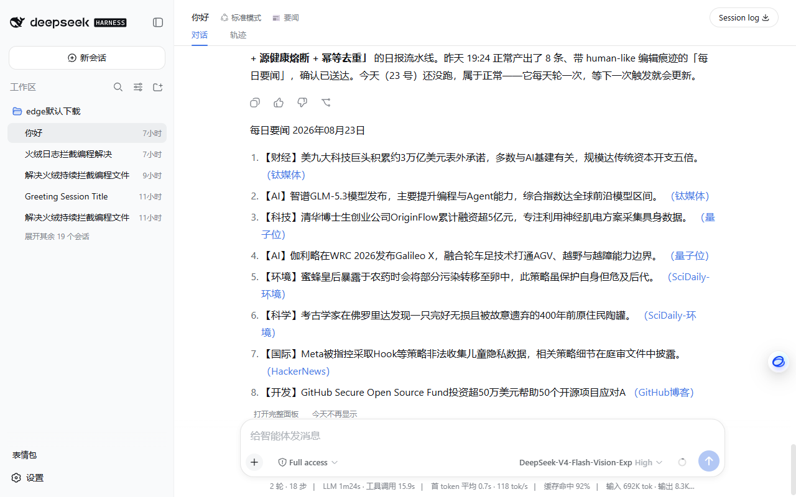

# 📰 dsh-rss-daily

> One line: every morning, dsh quietly prepares an editor-grade news digest for you — curated from 46 RSS sources by the model you already configured, delivered to your IM, and broadcast in the chat like a regular reply (zero context cost).

[中文说明](README.md)

[](https://www.npmjs.com/package/dsh-rss-daily)
[](LICENSE)

## What it looks like

The digest shows up **inside your conversation, styled exactly like a model reply** — plain markdown, same typography, same width:



It's frontend-only: displayed in the chat, but **never written to the session log and never sent to the model**. Your context stays clean.

## Why you'll like it

- **It reads like an editor picked it, not an aggregator.** ~20 candidates are scored (source tier × recency × signal words), deduplicated (Jaccard + 14-day MD5 history), cross-checked against a multi-source event graph, then handed to **your own dsh model** for the final edit: merge same-event reports, drop PR filler, balance topics (max 2 per tag), and compress each item into one concrete fact line (≤45 chars).
- **Zero extra API keys.** The editorial pass goes through `ctx.llm` — whatever model your dsh already runs. No new credentials, no extra bill.
- **It never misses a day.** If the model call fails, the digest degrades to a deterministic rule-based selection automatically. If dsh was down at the scheduled time, it catches up on next boot (within 12 h).
- **It comes to you.** Webhook delivery to ServerChan / PushDeer / WeCom / Telegram / Bark / gotify / any custom endpoint. At least one success counts as delivered.
- **Production-grade pipeline.** Ported from a personal script that has run daily since June 2026 through 9 revisions: per-source health tracking with adaptive timeouts, feed mojibake repair, full-text enrichment for thin summaries, a 420 s hard budget, and idempotent two-phase send (fetch → outbox → deliver → confirm).

## Quick start

```sh
# from npm (recommended)
dsh plugin --profile web add dsh-rss-daily

# or from GitHub
dsh plugin --profile web add github:shangjian2023/dsh-rss-daily
```

Restart `dsh web`. Every conversation header gets a **📰** button, and the daily schedule is live.

**30-second setup:**

1. Click the **📰** button in any conversation → **Settings** tab
2. Pick a time and add a delivery target (ServerChan / PushDeer / WeCom / Telegram / Bark / gotify / custom webhook)
3. Hit **Get today's digest** — the digest is generated right now, delivered to your webhook, and appears in the chat

No YAML editing required — everything (schedule, targets, sources, digest size, LLM provider) is editable in the panel and takes effect immediately.

## Highlights

- 🖥 **Three UIs, zero context cost**: the in-chat broadcast, the 📰 panel (digest / sources / settings), and the plugin settings card — all rendered client-side, never entering the session log
- 🧰 **46 curated sources** across tech / science / world / finance / humanities / dev, reachability-tested from mainland China; add or disable your own in the sources tab (unhealthy sources auto-degrade and rotate back)
- 🤖 **`rss_daily` agent tool** — `run` / `status` / `redo` / `deliver`, so you can also just ask the agent *"generate today's news digest"*
- 🔌 **Headless mode** — `py/daily.py` runs standalone with any OpenAI-compatible endpoint, no dsh required:

  ```sh
  RSS_LLM_ENDPOINT=https://api.deepseek.com/v1 RSS_LLM_KEY=sk-... \
    python py/daily.py --state-dir ~/.rss-daily
  ```

## Configuration

Defaults are sensible; the panel covers everything. The main knobs:

| Key | Default | Meaning |
|---|---|---|
| `time` | `08:00` | Local HH:MM to run daily (boot catch-up if missed <12 h). The digest title date is computed in Beijing time (UTC+8) |
| `targets[]` | `[]` | Delivery targets; delivered = at least one succeeded |
| `digestItems` | `8` | Max items per digest |
| `llmMode` | `harness` | `harness` (use dsh's model) or `none` (rule-based only) |
| `broadcast` | `true` | Show the in-chat digest card |
| `stateDir` | `~/.dsh/rss-daily` | Sources / dedup history / outbox live here |

Power users can also overlay the config row in the profile's `cordis.patch.yml`; see the [HTTP API and pipeline stages](README.md#http-api进阶) docs for the full surface.

## How it works

```
46 sources ──▶ fetch (health, timeouts, dedup) ──▶ ~20 candidates
                                                       │
                              ctx.llm editorial pass (rule fallback)
                                                       │
                                    digest ──▶ webhook targets ──▶ confirm
                                                       │
                              in-chat broadcast (frontend-only)
```

`py/daily.py` is independently scriptable (`--stage fetch|finalize|confirm|status`, single-line JSON on stdout); the plugin drives exactly these stages. Never confirms before at least one delivery succeeds — confirmed items enter the 14-day dedup window permanently.

## Requirements

- dsh with the `web` (or any long-running) profile
- Python 3.9+ with `feedparser` (`pip install feedparser`)
- Node.js ≥ 18 (bundled with dsh)

## License

MIT
